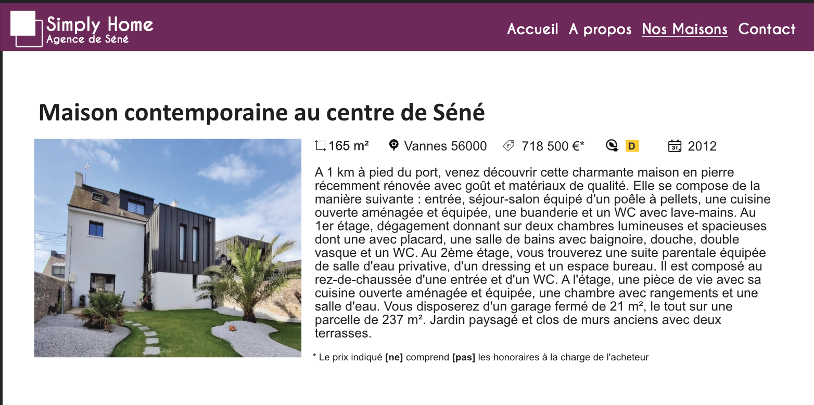
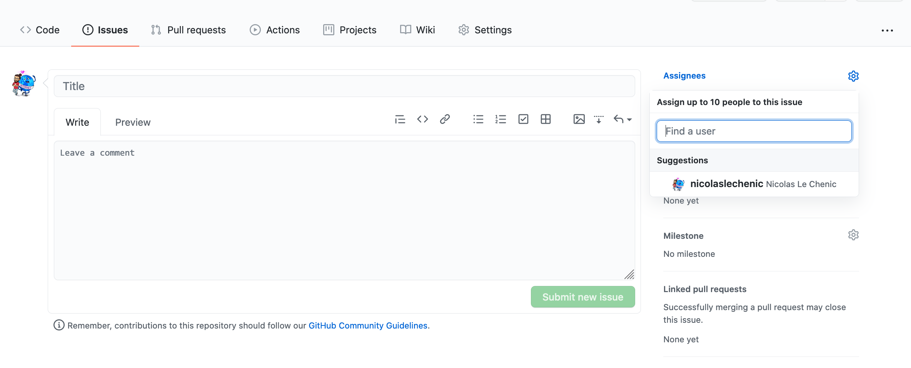

# S3 1er partie - Simply Dev (Git & Github)

#### Simply Home lance Simply Home - Agence immobilière

---

Après le succès retentissant du fameux constructeur de maisons individuelles, **Simply Home** lance son activité d'agence immobilière dans le Morbihan (56). Trois agences voient le jours à Vannes, Questembert et Auray avec des maisons en exclusivités !

### Simply-Dev

Dans cette première partie, vous intégrez le pôle de développement de Simply Home, responsable des sites web de la marque.

Afin de gagner du temps, le responsable de Simply-Home France à pris la décision d'adapter les site des constructeurs pour en faire des agences immobilières.

### Adaptations nécessaires

**Modifications de l'existant**

**Ajout d'une page annonce**

Une page annonce permet de voir le détaille d'une annonce immobilière.

Celle-ci comporte :

- Un titre
- Une image
- Une description
- Une barre d'informations
  - Taille en m²
  - Ville
  - Prix
  - Classe énergétique
  - Année de construction

**Exemple d'annonce**

Les icônes sont disponibles dans le dossier image.

#### Les agences

##### Agence de Vannes

[Lien de l'agence](https://simply-home.herokuapp.com/index.php)

**Ville couvertes par l'agence :**

- Vannes
- Séné 
- Auray

**Informations complémentaires**

Cette agence ne comprend pas les frais d'honoraires dans ses prix.

##### Agence d'Auray

[Lien de l'agence](https://simply-home-cda.herokuapp.com/pages/accueil.php)

**Ville couvertes par l'agence :**

- Auray
- Questembert 
- Vannes

**Informations complémentaires**

Cette agence comprend les frais d'honoraires dans ses prix.

##### Agence de Questembert

[Lien de l'agence](https://simply-home-group.herokuapp.com/Accueil.php)

**Ville couvertes par l'agence :**

- Questembert
- Séné 
- Vannes

**Informations complémentaires**

Cette agence comprend les frais d'honoraires dans ses prix.

### Objectifs

Pour cette première partie, vous allez devoir adapter les différents sites en équipe.

En plus des adaptations à effectuer, vous allez devoir ajouter 5 fiches maisons par ville. 

Chaque équipe aura donc un site avec 15 maisons visible depuis la liste des maisons. Chaque élément de la liste est cliquable et permet d'arriver sur la fiche d'une maison.

Afin de rendre vos examples plus pertinent, vous pouvez utiliser _leboncoin.fr_ ou _seloger.com_ par exemple.

#### Méthodologie

**Création des tâches**

Dans l'onglet issue (Github) ajouter chacune des tâches à effectuer.

Rédiger la tâche en question en vous aidant du template ci-dessous puis assigner les tâches.

["Template"](https://github.com/codeforamerica/howto/blob/master/issue_template.md)

### Facultatif :

**Ajouter des labels**

Vous pouvez créer des labels pour des sujets divers "bug", "integration", "template" etc... et les ajouter à chacune des tâches.

**Ajouter un projet**

Afin de suivre l'état d'avancement du projet, vous pouvez créer un nouveau projet (onglet project) et y ajouter des colonnes pour suivre l'état d'avancement des tâches.

Exemple de colonnes : 

#### Todo :
Les tâches à effectuer

#### In progress :
Les tâches en cours de développement

#### Review :
Les tâches en cours de revue par un membre de l'équipe

#### Done : 
Les tâches achevées

# S3 2eme partie - Boardimo (Ruby & SQlite)

__Mise au propre à venir__

Vous travaillez maintenant pour Boardimo, un site d'estimation de valeur de biens immobiliers.

Le but de ce site est de permettre la récupération, le stockage et la comparaison de données extraite des sites du groupe Simply-Home.

#### Les deux étapes clés 

##### Collecte de donnée 

Dans un premier temps vous allez créer un script capable de récupérer et stocker la donnée dans une base de donnée SQlite3.

Vous devrez avoir au moins deux tables :

- House
- City

##### Scrapping à la volée

Boardimo permettra aussi de récupérer le contenu d'une annonce de façon à ce que pour chaque saisie d'une nouvelle annonce (pas encore en base de donnée).

Cette étape permettra l'affichage de l'analyse de l'offre.

#### Analyse (WIP)

Afin de facilité l'affichage une maquette est présente dans ce dossier (index.html et style.css). L'analyse se divise en 4 étapes dont l'affichage évolue en fonction du résultat :

**vert (alert-success)** : Score favorable à très favorable
**jaune (alert-info)** : Score moyen à favorable
**orange (alert-warning)** : Score défavorable à moyen
**rouge (alert-danger)** : Score très défavorable à défavorable

##### Comparaison du prix au m²

La comparaison s'effectue par rapport à la moyenne du prix dans la ville ou se situe le bien.

- **vert** : prix du bien < moyenne * 0.75
- **jaune** : moyenne * 0.75 <= prix du bien < moyenne * 1.25
- **orange** : moyenne * 1.25 <= prix du bien < moyenne * 1.5
- **rouge** : prix du bien >= moyenne * 1.5

##### Année de construction

- **vert** (moins de 10 ans): 245€/m2 d'économies par rapport à la concurrence 
- **jaune** (entre 10 inclus et 20 ans exclus): 105€/m2 d'économies par rapport à la concurrence 
- **orange** (entre 20 ans inclus et 40 ans exclus): 95€/m2 de surcout par rapport à la concurrence 
- **rouge** (plus de 40 ans): 355€/m2 de surcout par rapport à la concurrence

##### Classe énergétique

**vert** (A et B)
- A : 216.6€/m2 d'économies par rapport à la concurrence 
- B : 161.5€/m2 d'économies par rapport à la concurrence 

**jaune** (C et D)
- C : 81.7€/m2 d'économies par rapport à la concurrence 
- D : 30.4€/m2 de surcout par rapport à la concurrence 

**orange** (E)
- E : 76€/m2 de surcout par rapport à la concurrence 

**rouge** (F et G)
- F : 188.1€/m2 de surcout par rapport à la concurrence 
- G : 340€/m2 de surcout par rapport à la concurrence 

##### Rapport final

__À venir__

